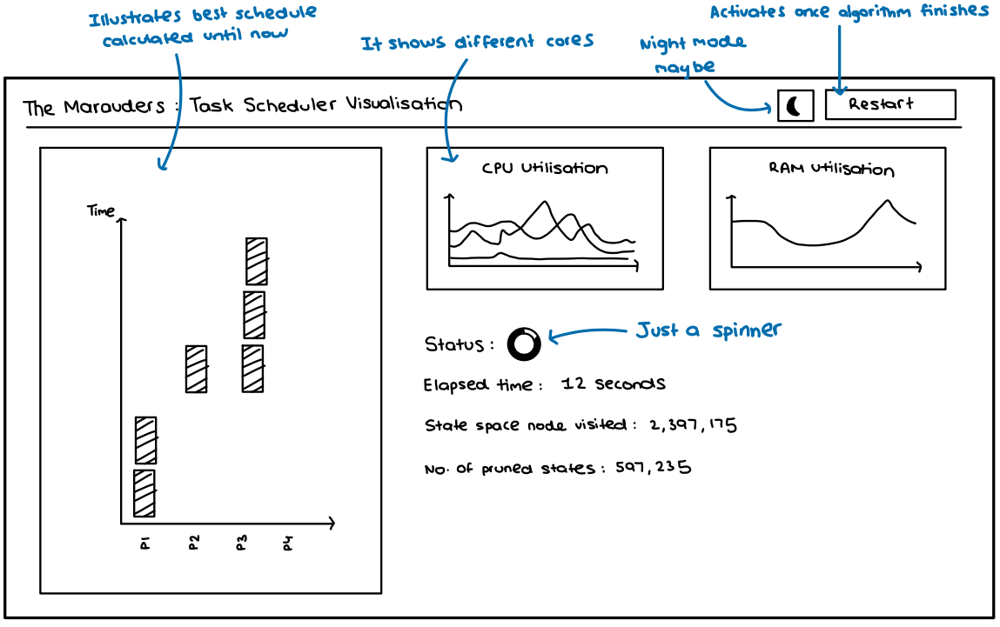
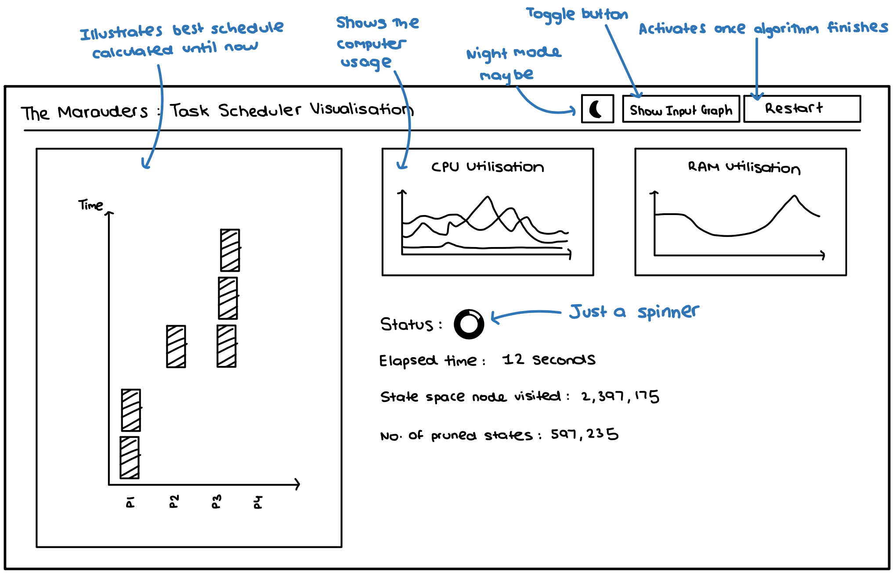
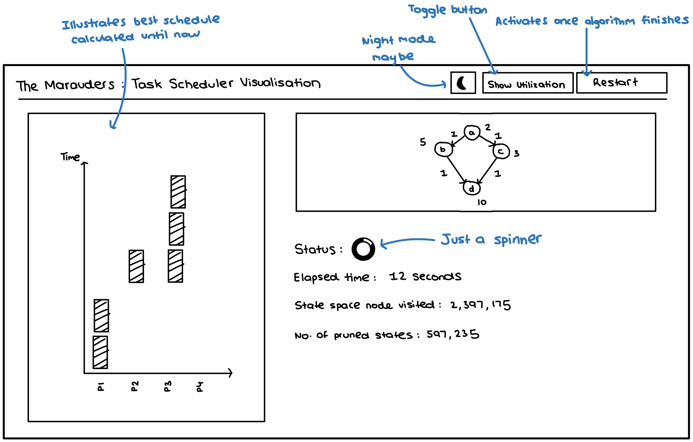

# Interface Prototype

> JavaFX will be used to create all components of the Graphical User Interface, as well as other dependencies for displaying the directed graphs and schedules.

From the beginning of the project, our team had pre-planned how we want to show the schedule visualization to our users. Through our early meetings and conversations, these were some of the things we wanted to include in our visualization.

- Pruning Statistics

- Best Schedule (which would update as the algorithm is executed)

- RAM and CPU usage to show how the multi-threading performance.

- How many of the state space has been explored so far?

From these early insights, we could start creating prototypes early-on in the project's lifecycle.

## Low-Fidelity Prototype

To get a preview of how the Graphical User Interface would look, below is a prototype which was created during the second week.

During the next iteration of this prototype, we decided to include the representation of the input directed graph as well, as the users would be able to understand how the final schedule is constructed. 

The images below show the improved low-fidelity prototype, where there is a toggle button for the user to switch between the CPU and RAM utilization, and visualization of the input graph.

## High-Fidelity Prototype

Below is the high-fidelity prototype for visualization screen:

We have decided to change the position of utilization graphs and the schedule graph (differed from low fidelity prototype) because it will be easier to swap input graph with utilization graphs.

Below is the high-fidelity prototype after removing title bar for light mode and dark mode:

After consideration, we have decided to add close button, minimize button, and a dark mode option for the visualization. This means we can remove the title bar and have a custom one.

